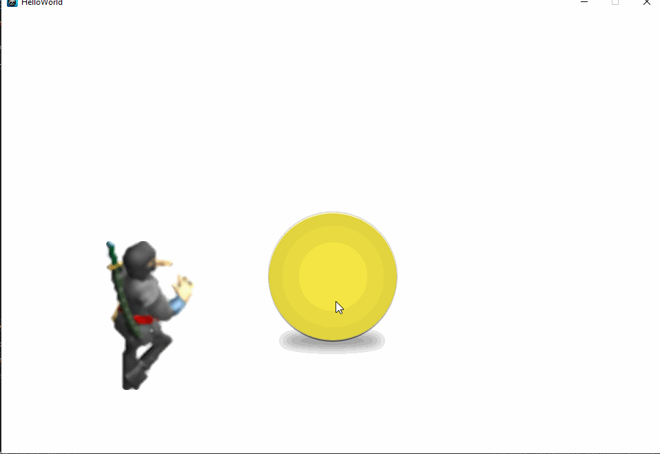

# Getting-Started_Cocos2Dx-Cpp

Checkout all branches to see my steps on learning Cocos2Dx 
Second step with Physics Collision, move Player, play Audio and more. 
Thanks to Guanghui Qui on Kodeco.com <3  
  

Learn about Tilemap  

<img src="spritesheet.png"?

 
 
